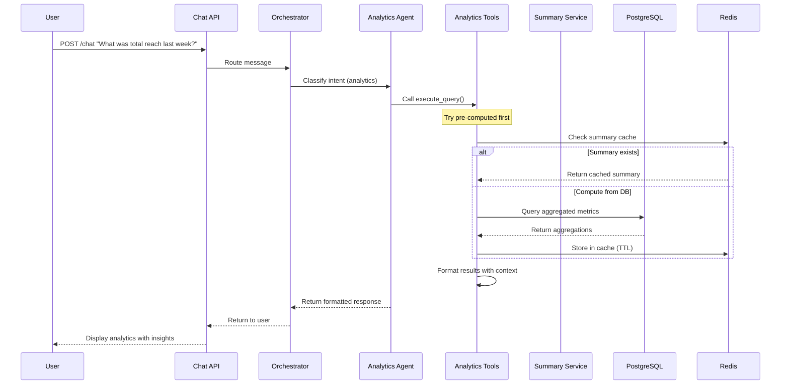
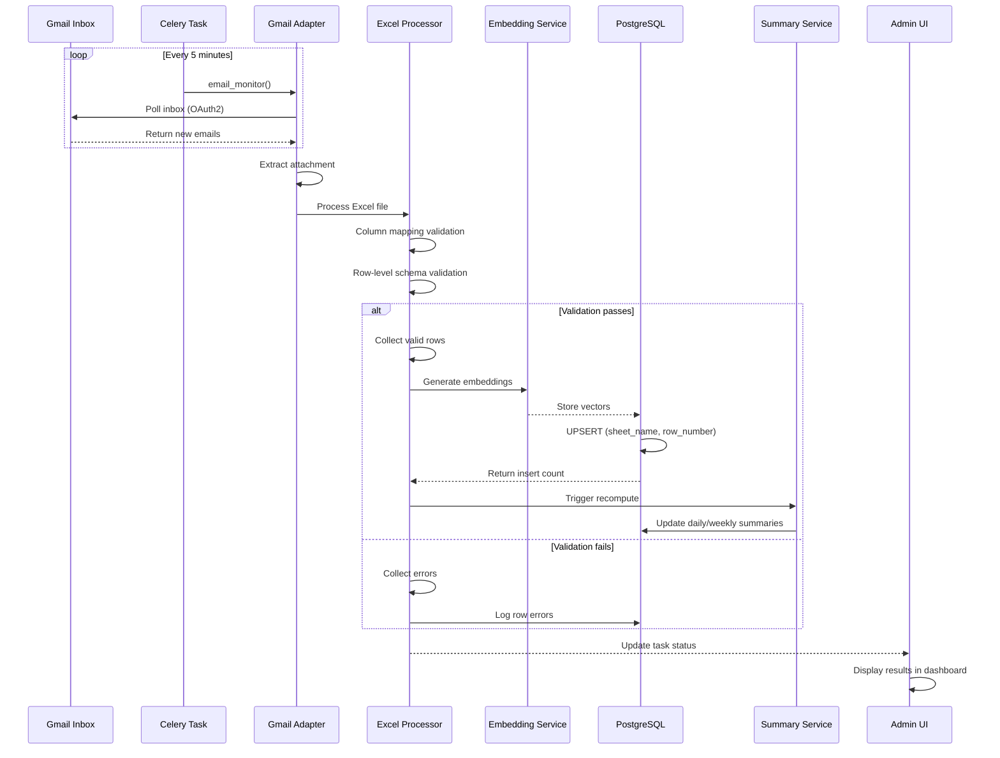
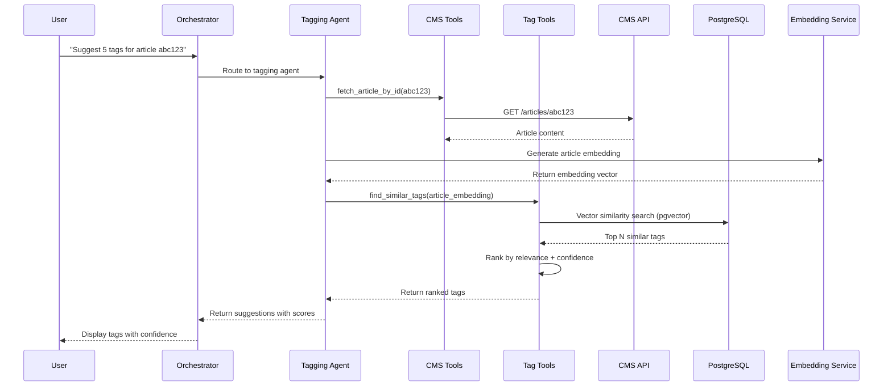
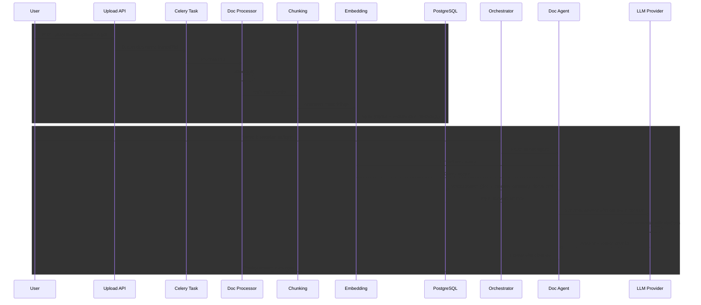
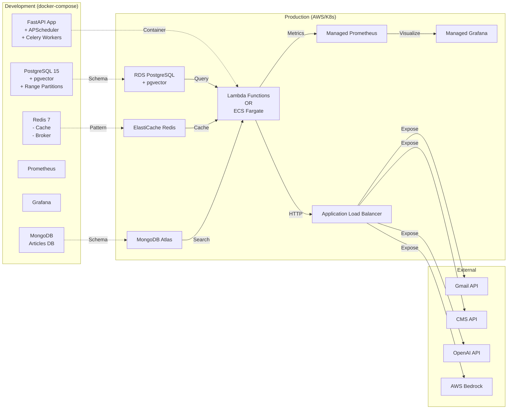

# Agentic Beast System Architecture - v3
**Last Updated**: 2026-03-18
**Status**: Current Production Architecture

---

## System Architecture Diagram

```mermaid
graph TB
    subgraph "Client Layer"
        WEB["🌐 Web Browser"]
        CLI["🖥️ CLI/API Client"]
    end

    subgraph "Frontend Layer"
        NEXTJS["Next.js 14 Frontend<br/>(React + TypeScript)"]
        LOGIN["Login Page"]
        ADMIN["Admin Dashboard<br/>- Ingestion Management<br/>- Schema Mapping<br/>- Task History"]
        CHAT["Chat Interface<br/>(Placeholder)"]
    end

    subgraph "API Gateway & Auth"
        FASTAPI["FastAPI Application<br/>Port: 8000"]
        AUTH_MIDDLEWARE["Authentication Middleware<br/>(JWT + LDAP)"]
        ERROR_HANDLER["Error Handling<br/>& Validation"]
        METRICS["Prometheus Metrics<br/>Middleware"]
    end

    subgraph "API Routes"
        CHAT_API["Chat Router<br/>POST /chat<br/>GET /conversations"]
        AUTH_API["Auth Router<br/>POST /auth/login"]
        INGEST_API["Ingestion Router<br/>POST /ingest/trigger<br/>GET /ingest/status"]
        ADMIN_INGEST["Admin Ingest Router<br/>GET /admin/ingestion<br/>POST /admin/ingestion/..."]
        HEALTH_API["Health Router<br/>GET /health<br/>GET /metrics"]
    end

    subgraph "Orchestration Layer"
        ORCHESTRATOR["🤖 Agent Orchestrator<br/>- Intent Classification<br/>- Agent Routing<br/>- Handoff Management"]

        subgraph "Agent Pool"
            ANALYTICS_AGENT["📊 Analytics Agent<br/>- Query Generation<br/>- Publishing Insights"]
            INGEST_AGENT["📥 Ingestion Agent<br/>- Task Management<br/>- Status Reporting"]
            TAG_AGENT["🏷️ Tag Agent<br/>(Scaffolded)"]
            REC_AGENT["📖 Recommendation Agent<br/>(Scaffolded)"]
            DOC_AGENT["📄 Document Agent<br/>(Scaffolded)"]
            GENERAL_AGENT["💬 General Assistant<br/>(Fallback)"]
        end
    end

    subgraph "Tool Layer"
        ANALYTICS_TOOLS["Analytics Tools<br/>- execute_query()<br/>- get_publishing_insights()"]

        CMS_TOOLS["CMS Tools<br/>- fetch_article_by_id()<br/>- search_articles()<br/>(Scaffolded)"]

        TAG_TOOLS["Tag Tools<br/>- find_similar_tags()<br/>- rank_tags_by_relevance()<br/>(Scaffolded)"]

        DOC_TOOLS["Document Tools<br/>- search_documents()<br/>- format_citations()<br/>(Scaffolded)"]
    end

    subgraph "Data Adapter Layer"
        GMAIL_ADAPTER["📧 Gmail Adapter<br/>- OAuth2 Auth<br/>- Inbox Polling<br/>- Attachment Download"]

        CMS_ADAPTER["🔌 CMS API Adapter<br/>- Article Fetch<br/>- MongoDB Search<br/>(Scaffolded)"]

        REGISTRY["Adapter Registry<br/>- Discovery<br/>- Configuration"]
    end

    subgraph "Processing Layer"
        EXCEL_PROC["Excel Processor<br/>- Column Mapping<br/>- Row Validation<br/>- Error Collection"]

        DOC_PROC["Document Processor<br/>- PDF Extraction<br/>- Text Chunking<br/>- Metadata Preservation<br/>(Scaffolded)"]

        EMBED_SVC["Embedding Service<br/>all-MiniLM-L6-v2<br/>- Batch Generation<br/>- Vector Indexing"]
    end

    subgraph "AI Provider Layer"
        PROVIDER_FACTORY["AI Provider Factory<br/>Config-based Switching"]

        OPENAI_PROVIDER["🔴 OpenAI Provider<br/>- Chat Completion<br/>- Text Embedding"]

        BEDROCK_PROVIDER["🟠 AWS Bedrock<br/>- Chat Completion<br/>- Anthropic Claude"]
    end

    subgraph "Task Queue & Scheduling"
        CELERY["🔄 Celery Task Queue<br/>(Redis Broker)"]
        APSCHEDULER["⏰ APScheduler<br/>- Email Polling<br/>- Summary Compute<br/>- Folder Watch"]

        subgraph "Async Tasks"
            EMAIL_TASK["email_monitor()<br/>Poll Gmail Inbox<br/>Default: 5min"]
            EXCEL_TASK["excel_ingest()<br/>Process Excel<br/>Manual Trigger"]
            SUMMARY_TASK["summary_compute()<br/>Daily/Weekly/Monthly<br/>Post-Ingestion"]
            FOLDER_TASK["folder_watch()<br/>Monitor /watched_documents<br/>(Scaffolded)"]
        end
    end

    subgraph "Storage Layer"
        subgraph "PostgreSQL 15"
            DOCUMENTS["📋 documents table<br/>- Partitioned by report_date<br/>- Social media analytics"]
            TAGS["🏷️ tags table<br/>- name, slug, description<br/>- embedding vector (pgvector)"]
            USERS["👤 users table<br/>- Local + AD accounts"]
            CONVERSATIONS["💬 conversations table<br/>- Session metadata"]
            MESSAGES["📝 messages table<br/>- User + Assistant messages"]
            SUMMARIES["📊 summaries table<br/>- Daily/Weekly/Monthly<br/>- Pre-computed aggregations"]
            TIME_METRICS["⏰ time_of_day_metrics<br/>- Hour-of-day performance<br/>- Publishing insights"]
            INGEST_TASKS["📥 ingestion_tasks table<br/>- Task tracking<br/>- Result logging"]
        end

        subgraph "MongoDB (Articles)"
            ARTICLES["📚 Article Documents<br/>- CMS articles<br/>- Vector embeddings<br/>- Bulk search ready"]
        end

        subgraph "Redis (Caching & Queue)"
            REDIS_CACHE["Cache Layer<br/>- Summaries<br/>- Session State<br/>- Agent Context"]
            REDIS_BROKER["Celery Broker<br/>- Task Queue<br/>- Result Backend"]
            AGENT_STATE["Agent State<br/>- Execution Context<br/>- Health Status"]
        end
    end

    subgraph "Monitoring & Observability"
        PROMETHEUS["📈 Prometheus<br/>- Metrics Collection<br/>- Request Histograms<br/>- Agent Execution Metrics"]

        GRAFANA["📊 Grafana<br/>- Dashboards<br/>- Visualization<br/>- Alerting"]

        STRUCTLOG["📝 Structured Logging<br/>- JSON Output<br/>- Correlation IDs<br/>- Request/Response Logs"]

        SENTRY["🚨 Sentry Error Tracking<br/>- Exception Aggregation<br/>- Breadcrumb Trail<br/>- Environment Tagging"]
    end

    subgraph "External Services"
        GMAIL_API["Gmail API<br/>- Email Retrieval<br/>- OAuth2 Tokens"]

        CMS_API["CMS API<br/>- Article Endpoints<br/>- Authentication"]

        OPENAI_API["OpenAI API<br/>- gpt-4o<br/>- Embeddings"]

        AWS_BEDROCK["AWS Bedrock<br/>- Claude 3<br/>- Inference"]
    end

    subgraph "Docker Infrastructure"
        COMPOSE["docker-compose.yml<br/>- PostgreSQL 15<br/>- Redis 7<br/>- MongoDB<br/>- Prometheus<br/>- Grafana<br/>- FastAPI App"]
    end

    %% Client to Frontend
    WEB -->|Browser| NEXTJS
    CLI -->|HTTP| FASTAPI

    %% Frontend to API
    NEXTJS -->|/login| AUTH_API
    NEXTJS -->|/chat| CHAT_API
    NEXTJS -->|/admin/ingestion| ADMIN_INGEST
    NEXTJS -->|/ingest| INGEST_API

    %% Frontend Structure
    NEXTJS -->|Layout| LOGIN
    NEXTJS -->|Routes| ADMIN
    NEXTJS -->|Routes| CHAT

    %% API Layer
    FASTAPI --> AUTH_MIDDLEWARE
    FASTAPI --> ERROR_HANDLER
    FASTAPI --> METRICS
    FASTAPI --> CHAT_API
    FASTAPI --> AUTH_API
    FASTAPI --> INGEST_API
    FASTAPI --> ADMIN_INGEST
    FASTAPI --> HEALTH_API

    %% Orchestration
    CHAT_API -->|Route| ORCHESTRATOR
    INGEST_API -->|Route| ORCHESTRATOR
    ADMIN_INGEST -->|Route| ORCHESTRATOR

    ORCHESTRATOR -->|Intent: analytics| ANALYTICS_AGENT
    ORCHESTRATOR -->|Intent: ingestion| INGEST_AGENT
    ORCHESTRATOR -->|Intent: tagging| TAG_AGENT
    ORCHESTRATOR -->|Intent: recommendation| REC_AGENT
    ORCHESTRATOR -->|Intent: document_qa| DOC_AGENT
    ORCHESTRATOR -->|Fallback| GENERAL_AGENT

    %% Agent to Tools
    ANALYTICS_AGENT -->|Tool Calls| ANALYTICS_TOOLS
    INGEST_AGENT -->|Monitor Task| EXCEL_TASK
    TAG_AGENT -->|Tool Calls| TAG_TOOLS
    REC_AGENT -->|Tool Calls| CMS_TOOLS
    DOC_AGENT -->|Tool Calls| DOC_TOOLS

    %% Tools to Adapters & Processing
    ANALYTICS_TOOLS -->|Query| DOCUMENTS
    TAG_TOOLS -->|Search| TAGS
    TAG_TOOLS -->|Embed| EMBED_SVC
    CMS_TOOLS -->|Fetch| CMS_ADAPTER
    DOC_TOOLS -->|Search| DOCUMENTS

    %% Adapters
    GMAIL_ADAPTER -->|Fetch Emails| GMAIL_API
    CMS_ADAPTER -->|API Call| CMS_API

    %% Processing Pipeline
    GMAIL_ADAPTER -->|Extract Attachment| EXCEL_PROC
    EXCEL_PROC -->|Validate| DOCUMENTS
    EXCEL_PROC -->|Extract Rows| EMBED_SVC
    EMBED_SVC -->|Store Vectors| DOCUMENTS
    EXCEL_PROC -->|Trigger| SUMMARY_TASK

    DOC_PROC -->|Chunk| EMBED_SVC

    %% Provider Selection
    ANALYTICS_AGENT -->|LLM Call| PROVIDER_FACTORY
    TAG_AGENT -->|LLM Call| PROVIDER_FACTORY
    REC_AGENT -->|LLM Call| PROVIDER_FACTORY
    DOC_AGENT -->|LLM Call| PROVIDER_FACTORY
    GENERAL_AGENT -->|LLM Call| PROVIDER_FACTORY
    EMBED_SVC -->|Embed| PROVIDER_FACTORY

    PROVIDER_FACTORY -->|Config: openai| OPENAI_PROVIDER
    PROVIDER_FACTORY -->|Config: bedrock| BEDROCK_PROVIDER

    %% AI Provider Calls
    OPENAI_PROVIDER -->|API| OPENAI_API
    BEDROCK_PROVIDER -->|API| AWS_BEDROCK

    %% Task Queue
    EMAIL_TASK -->|Celery Task| CELERY
    EXCEL_TASK -->|Celery Task| CELERY
    SUMMARY_TASK -->|Celery Task| CELERY
    FOLDER_TASK -->|Celery Task| CELERY

    CELERY -->|Broker| REDIS_BROKER
    APSCHEDULER -->|Trigger| EMAIL_TASK
    APSCHEDULER -->|Trigger| SUMMARY_TASK
    APSCHEDULER -->|Trigger| FOLDER_TASK

    %% Storage Access
    INGEST_TASK -->|Read/Write| DOCUMENTS
    INGEST_TASK -->|Read/Write| INGEST_TASKS
    SUMMARY_TASK -->|Compute| SUMMARIES
    SUMMARY_TASK -->|Compute| TIME_METRICS
    EMBED_SVC -->|Index| TAGS

    EMAIL_TASK -->|Update Status| INGEST_TASKS
    EXCEL_TASK -->|Update Status| INGEST_TASKS

    %% Data Access
    DOCUMENTS -->|Partitioned by date| DOCUMENTS
    CONVERSATIONS -->|Link| MESSAGES
    USERS -->|Reference| CONVERSATIONS

    %% Redis Usage
    REDIS_CACHE -->|Cache| SUMMARIES
    AGENT_STATE -->|Store Context| ORCHESTRATOR
    REDIS_BROKER -->|Task Queue| CELERY

    %% Monitoring
    FASTAPI -->|Expose Metrics| PROMETHEUS
    CELERY -->|Task Metrics| PROMETHEUS
    INGEST_TASK -->|Metrics| PROMETHEUS

    PROMETHEUS -->|Scrape| GRAFANA
    STRUCTLOG -->|Log Output| SENTRY
    PROMETHEUS -->|Alert| SENTRY

    %% Infrastructure
    COMPOSE -->|Run Services| FASTAPI
    COMPOSE -->|Run Services| PROMETHEUS
    COMPOSE -->|Run Services| GRAFANA
    COMPOSE -->|Run Services| DOCUMENTS
    COMPOSE -->|Run Services| REDIS_BROKER
```



---

## Data Flow Diagrams

### 1. Analytics Query Flow (User Story 1)



### 2. Excel Ingestion Flow (User Story 2)



### 3. Tag Suggestion Flow (User Story 3 - Scaffolded)



### 4. Document Q&A Flow (User Story 5 - Scaffolded)



---

## Component Interaction Matrix

| Component | Consumes | Produces | Status |
|-----------|----------|----------|--------|
| **Orchestrator** | Chat messages, intents | Agent routing | ✅ Complete |
| **Analytics Agent** | Analytics queries | Query results, insights | ✅ Complete |
| **Ingestion Agent** | Ingestion requests | Task status | ✅ Complete |
| **Tag Agent** | Tag requests | Tag suggestions | 🟡 Scaffolded |
| **Recommendation Agent** | Article queries | Article recommendations | 🟡 Scaffolded |
| **Document Agent** | Q&A queries | Answers + citations | 🟡 Scaffolded |
| **General Agent** | General queries | LLM responses | 🟡 Scaffolded |
| **Analytics Tools** | Database queries | Aggregations, insights | ✅ Complete |
| **Gmail Adapter** | Gmail API | Emails, attachments | ✅ Complete |
| **Excel Processor** | Raw files | Validated rows | ✅ Complete |
| **CMS Tools** | CMS API | Article data | 🟡 Scaffolded |
| **Tag Tools** | Tag database | Similar tags | 🟡 Scaffolded |
| **Doc Tools** | Document database | Chunks + citations | 🟡 Scaffolded |
| **Embedding Service** | Text content | Vectors | ✅ Complete |
| **Summary Service** | Document aggregates | Pre-computed summaries | ✅ Complete |
| **PostgreSQL** | All services | Persistent data | ✅ Complete |
| **MongoDB** | CMS integration | Article documents | 🟡 Scaffolded |
| **Redis** | Cache/queue consumers | Cached data, task queue | ✅ Complete |
| **Celery** | APScheduler | Async task execution | ✅ Complete |
| **APScheduler** | System clock | Task triggering | ✅ Complete |

---

## Deployment Architecture



---

## Technology Stack Summary

```
┌─────────────────────────────────────────────────────────────────┐
│                    FRONTEND LAYER                               │
├─────────────────────────────────────────────────────────────────┤
│ Next.js 14 | React 18 | TypeScript | Tailwind CSS | Axios       │
└─────────────────────────────────────────────────────────────────┘

┌─────────────────────────────────────────────────────────────────┐
│                    API & ORCHESTRATION                          │
├─────────────────────────────────────────────────────────────────┤
│ FastAPI 0.104+ | Strands Agents SDK | Pydantic V2               │
│ Uvicorn | ASGI                                                  │
└─────────────────────────────────────────────────────────────────┘

┌─────────────────────────────────────────────────────────────────┐
│                  ASYNC & TASK EXECUTION                         │
├─────────────────────────────────────────────────────────────────┤
│ SQLAlchemy 2.0 (async) | Celery 5 | Redis 7 | APScheduler       │
│ asyncio | asyncpg | aiohttp | httpx                             │
└─────────────────────────────────────────────────────────────────┘

┌─────────────────────────────────────────────────────────────────┐
│                      DATA & STORAGE                             │
├─────────────────────────────────────────────────────────────────┤
│ PostgreSQL 15 (pgvector) | MongoDB (Motor) | Redis              │
│ Alembic | SQLAlchemy ORM                                        │
└─────────────────────────────────────────────────────────────────┘

┌─────────────────────────────────────────────────────────────────┐
│               AI PROVIDERS & EMBEDDINGS                         │
├─────────────────────────────────────────────────────────────────┤
│ OpenAI SDK | boto3 (Bedrock) | sentence-transformers           │
│ all-MiniLM-L6-v2 (local embeddings)                             │
└─────────────────────────────────────────────────────────────────┘

┌─────────────────────────────────────────────────────────────────┐
│            DATA PROCESSING & INTEGRATION                        │
├─────────────────────────────────────────────────────────────────┤
│ Pandas | openpyxl | PyPDF2 | google-auth-oauthlib              │
│ langchain-text-splitters | LangChain                            │
└─────────────────────────────────────────────────────────────────┘

┌─────────────────────────────────────────────────────────────────┐
│           MONITORING, LOGGING & OBSERVABILITY                   │
├─────────────────────────────────────────────────────────────────┤
│ structlog | Prometheus | Grafana | Sentry | Python logging      │
│ prometheus-client                                               │
└─────────────────────────────────────────────────────────────────┘

┌─────────────────────────────────────────────────────────────────┐
│                  AUTHENTICATION & SECURITY                      │
├─────────────────────────────────────────────────────────────────┤
│ PyJWT | passlib[bcrypt] | LDAP (python-ldap) | python-jose      │
└─────────────────────────────────────────────────────────────────┘

┌─────────────────────────────────────────────────────────────────┐
│                    INFRASTRUCTURE                               │
├─────────────────────────────────────────────────────────────────┤
│ Docker | Docker Compose | Python 3.11+ | Bash                  │
└─────────────────────────────────────────────────────────────────┘
```

---

## Scalability Considerations

### Horizontal Scaling
- **API Layer**: Multiple FastAPI instances behind load balancer
- **Task Workers**: Multiple Celery workers for parallel ingestion
- **Database**: PostgreSQL read replicas for analytics queries
- **Cache**: Redis cluster for distributed caching

### Vertical Scaling
- **PostgreSQL**: Increased memory for query cache and index buffers
- **Redis**: Larger memory footprint for expanded cache
- **Celery Workers**: More CPU cores for parallel task execution
- **FastAPI**: Larger instance type with increased worker threads

### Data Partitioning
- **Time-based**: Documents table partitioned by report_date (monthly)
- **Range-based**: Archive old partitions for cold storage
- **Vector Search**: pgvector indexes for semantic search optimization
- **Task Distribution**: Separate Celery queues for ingestion vs. summary tasks

### Caching Strategy
- **Summary Cache**: Pre-computed aggregations cached in Redis (24h TTL)
- **Query Cache**: Analytics query results (1h TTL)
- **Agent State**: Session context in Redis (session duration)
- **Embedding Cache**: Pre-computed embeddings for tags (permanent)

---

## Future Architecture Enhancements

### Near-term (Q2 2026)
- **WebSocket Support**: Real-time streaming for chat responses
- **Message Streaming**: Server-sent events (SSE) for long-running tasks
- **Vector DB**: Dedicated vector database (Pinecone, Weaviate) for large-scale embeddings
- **Cache Invalidation**: Intelligent cache invalidation strategies

### Mid-term (Q3 2026)
- **Multi-tenant**: Tenant isolation with shared infrastructure
- **API Gateway**: Kong or AWS API Gateway for rate limiting, auth
- **Queue Scaling**: Message queue partitioning (Kafka for event streaming)
- **GraphQL**: Optional GraphQL layer alongside REST API

### Long-term (Q4 2026+)
- **Federated Learning**: Privacy-preserving ML model training
- **Microservices**: Decompose into independently deployable services
- **Mesh Architecture**: Service mesh (Istio) for advanced traffic management
- **Edge Deployment**: Edge AI for latency-sensitive operations

---

## Legend

| Symbol | Meaning |
|--------|---------|
| ✅ | Fully Implemented |
| 🟡 | Scaffolded / Partial |
| ❌ | Not Implemented |
| 🤖 | AI/Agent Component |
| 📊 | Analytics/Data |
| 📥 | Ingestion/Input |
| 📄 | Document Processing |
| 🏷️ | Tag/Metadata |
| 💬 | Chat/Conversation |
| ⏰ | Scheduling/Time-based |
| 📈 | Monitoring/Metrics |
| 🚨 | Error/Alert |

---

**Version History**:
- **v1**: Initial architecture (2026-03-05)
- **v2**: Analytics + Ingestion complete (2026-03-15)
- **v3**: Admin UI + Enhanced observability (2026-03-18)

**Next Update**: After US3-US6 implementation (estimated 2026-04-30)
